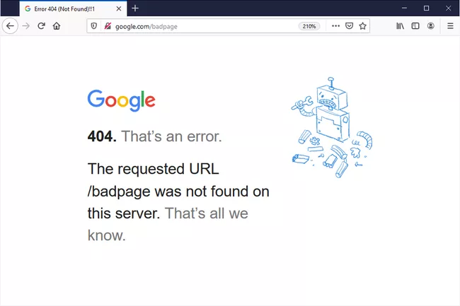

# Session 1 Notes

## Plan for Today
1. [Install Python IDE, packages](Python_IDE_Setup.md)
2. Understanding HTTP, interacting with API
3. Set up API credentials
4. Live code to pull data
    - What Elon Musk tweeted
    - What kind of tweets that Taylor Swift liked
    - Tweets related to ND Sports with hashtag #GoIrish
    - What are people talking about Justice Breyer's retirement (Time Permitting)


## HTTP and 404

>### HTTP


>  #### What is HTTP protocol?
>  Client Request - Server Response
>  #### How is HTTP related to Twitter API?
>  The data pulling through Twitter API follows HTTP protocol. It is very helpful to debug when the API returns error message.
> #### Frequent HTTP Status Code:
> 1. Successful responses: 200(Successful)
> 2. Client error response: 401(Unauthorized), 403(Forbidden), 404(Not Found)
     - Response Status Code starting with 4 means the client end has error(s).
> 3. Server error response: 500(Internal Server Error), 503(Service Unavailable)
     - Response Status Code starting with 5 means the server end(Twitter Server) has error(s).

## Tweet Cap and Rate Limit
> 1. [Monthly Tweet Cap](https://developer.twitter.com/en/portal/dashboard)
> 2. [Rate Limit](https://developer.twitter.com/en/portal/products)

## Example 1: Pull Elon Musk's Timeline
   [Elon Musk Tweets](https://twitter.com/elonmusk)

   There is a cap of 3200 tweets for pulling a certain user's timeline.

   Each request allows a maximum of 100 tweets, use for loop to send multiple requests.

   To pull more than 3200 tweets of user's timeline, use search_all_tweets and query operators.

## Tweet API Basics
1. By default, the API only returns the ```id``` and the ```text``` fields.

2. Tweepy Response
    - ```data```
    - ```error```
    - ```includes```
      - ```user```
      - ```tweet```
    - ```meta```

3. Request additional fields
    - ```author_id```
    - ```context_annotations```
    - ```conversation_id```
    - ```created_at```
    - ```entities```
    - ```in_reply_to_user_id```
    - ```public_metrics```
    - ```referenced_tweets```
4. Expansions
   An example:

   

   

## Example 2: Pull Tweets Taylor Swift liked

   > There is a cap of 3200 tweets for pulling a certain user's timeline.
   > Each request allows a maximum of 100 tweets, use for loop to send multiple requests.
   > To pull more than 3200 tweets of user's timeline, use search_all_tweets and query operators.

5. Query
    - ```keyword```
    - ```"exact phrase match"```
    - ```#```
    - ```@```
    - ```from:	```
    - ```to:```
    - ```conversation_id:```
    - ```is:retweet```
    - ```is:quote```
    - ```negation```

  [Full Query Parameters](https://developer.twitter.com/en/docs/twitter-api/tweets/search/integrate/build-a-query)


### End

  [Submit questions and issues here](https://github.com/Lucy-Family-Institute/CSSR-Workshop-Twitter/issues)
